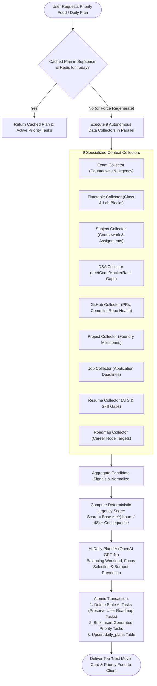
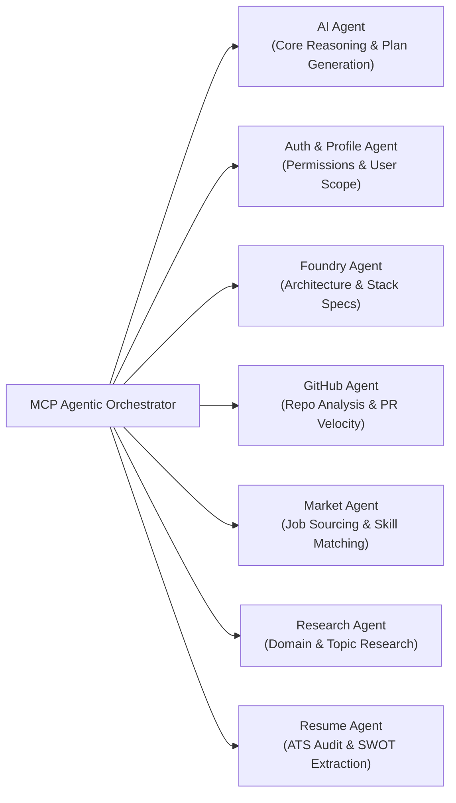

# PrioryxAI

<div align="center">

# ⚡ PrioryxAI (formerly DeadlineOS)
### The AI-Powered Operating System & Career Intelligence Platform for Students

[](https://nextjs.org/)
[](https://reactjs.org/)
[](https://www.typescriptlang.org/)
[](https://tailwindcss.com/)
[](https://supabase.com/)
[](https://openai.com/)
[](https://upstash.com/)
[](https://expo.dev/)
[](https://developer.apple.com/swift/)
[](https://kotlinlang.org/)
[](https://razorpay.com/)

<p align="center">
  <strong>Transforming academic overload, fragmented deadlines, and career ambiguity into an explainable, daily execution feed.</strong>
</p>

</div>

---

## 📖 Table of Contents

- [Overview](#-overview)
- [System Architecture](#-system-architecture)
  - [High-Level Platform Architecture](#high-level-platform-architecture)
  - [Decision & Priority Orchestrator Flow](#decision--priority-orchestrator-flow)
  - [Model Context Protocol (MCP) Multi-Agent Architecture](#model-context-protocol-mcp-multi-agent-architecture)
  - [Deterministic Placement Readiness Model](#deterministic-placement-readiness-model)
- [Key Features](#-key-features)
  - [1. Explainable Priority Feed & Daily Planner](#1-explainable-priority-feed--daily-planner)
  - [2. Academic & Schedule Intelligence (OCR / Vision)](#2-academic--schedule-intelligence-ocr--vision)
  - [3. Interactive Career Roadmaps (30+ Industry Tracks)](#3-interactive-career-roadmaps-30-industry-tracks)
  - [4. Weekly Smart Workload Scheduler](#4-weekly-smart-workload-scheduler)
  - [5. GitHub Portfolio & Security Intelligence](#5-github-portfolio--security-intelligence)
  - [6. Coding Intelligence (LeetCode & HackerRank)](#6-coding-intelligence-leetcode--hackerrank)
  - [7. AI Resume Intelligence & ATS SWOT Studio](#7-ai-resume-intelligence--ats-swot-studio)
  - [8. Project Foundry (AI Portfolio Architect)](#8-project-foundry-ai-portfolio-architect)
  - [9. Real-Time Multi-Source Job Market Aggregator](#9-real-time-multi-source-job-market-aggregator)
  - [10. Contextual AI Assistant, Memory & Bounded Tools](#10-contextual-ai-assistant-memory--bounded-tools)
  - [11. Peer Collaboration & Privacy-Preserving Cohort Intelligence](#11-peer-collaboration--privacy-preserving-cohort-intelligence)
  - [12. Gamification, Streaks & Daily Challenges](#12-gamification-streaks--daily-challenges)
- [Cross-Platform Ecosystem](#-cross-platform-ecosystem)
- [Repository Structure](#-repository-structure)
- [Tech Stack](#-tech-stack)
- [Getting Started](#-getting-started)
  - [Prerequisites](#prerequisites)
  - [Installation](#installation)
  - [Environment Configuration](#environment-configuration)
  - [Database & Migrations](#database--migrations)
  - [Running the Web Application](#running-the-web-application)
  - [Running Mobile Applications](#running-mobile-applications)
  - [Running Tests & Quality Assurance](#running-tests--quality-assurance)
- [API Reference](#-api-reference)
- [Security, Privacy & Ethics](#-security-privacy--ethics)
- [License & Contributing](#-license--contributing)

---

## 🌟 Overview

Students and aspiring software engineers juggle an overwhelming number of disconnected platforms: college timetables, exam portals, assignment trackers, GitHub repositories, LeetCode/HackerRank problem queues, resumes, and internship job boards. 

**PrioryxAI** unifies these disparate streams into a **single, explainable "Next Move" operating system**. 

Rather than relying purely on opaque black-box AI recommendations, PrioryxAI implements a **hybrid decision engine**:
- **Deterministic Math & Rules Engine**: Powers mission-critical prioritization, deadline decay calculations, placement readiness scoring, and privacy-preserving cohort metrics with zero hallucination risk.
- **Multimodal AI & LLMs (OpenAI GPT-4o / Claude)**: Leveraged where natural language synthesis, vision extraction, OCR timetable parsing, SWOT resume auditing, and conversational problem-solving excel.
- **Fail-Safe Degradation**: If third-party APIs, vector embeddings, or Redis instances go offline, PrioryxAI gracefully falls back to deterministic rules, local caches, and lexical keyword search.

---

## 🏗️ System Architecture

### High-Level Platform Architecture

```mermaid
graph TB
    subgraph Clients["Client Layer"]
        Web["Next.js 14 Web App<br/>(Tailwind, Framer Motion, Neumorphic UI)"]
        ExpoApp["PrioryxAI Expo App<br/>(React Native, NativeWind, Zustand)"]
        iOSApp["PrioryxAI-iOS<br/>(Native SwiftUI & Xcode Scaffold)"]
        AndroidApp["PrioryxAI-Android<br/>(Native Kotlin & Jetpack)"]
        CapacitorWrapper["Capacitor Native Shell<br/>(Android / iOS Webview)"]
    end

    subgraph APILayer["Next.js 14 App Router API Layer (Node.js Runtime)"]
        AuthRoute["/api/auth/* (Supabase Auth & SSR)"]
        PriorityRoute["/api/priority & /api/feed"]
        AssistantRoute["/api/assistant (SSE Streaming + Tools)"]
        CareerRoute["/api/career/* (Roadmap, Collab, Market)"]
        ScheduleRoute["/api/schedule/* (Vision OCR Timetables)"]
        ResumeRoute["/api/resume/* (Mammoth & PDF Extraction)"]
        IntegrationsRoute["/api/github, /api/leetcode, /api/hackerrank"]
        PaymentRoute["/api/payments/* (Razorpay Webhooks)"]
    end

    subgraph DecisionEngine["Intelligence & Decision Layer"]
        Orchestrator["Priority Orchestrator"]
        Collectors["9 Autonomous Data Collectors"]
        DecayModel["Exponential Urgency Decay Engine"]
        ReadinessEngine["Placement Readiness Model (v3)"]
        MCPMultiAgent["MCP Agentic Orchestrator (7 Agents)"]
        RAGModule["RAG Pipeline (pgvector + Lexical Fallback)"]
    end

    subgraph DataPlane["Data & Infrastructure Plane"]
        Postgres["Supabase PostgreSQL<br/>(Row Level Security & pgvector)"]
        SupabaseStorage["Supabase Storage<br/>(Resumes, Schedules, Avatars)"]
        Redis["Upstash Redis<br/>(Rate Limiting & Decision Caching)"]
        QStash["Upstash QStash<br/>(Signed Background Cron Triggers)"]
    end

    subgraph ExternalServices["External Providers & APIs"]
        OpenAI["OpenAI (GPT-4o, Text-Embeddings)"]
        GitHubAPI["GitHub GraphQL & REST API"]
        OSV["OSV.dev Vulnerability API"]
        JobAggregators["Job Boards (Remotive, RemoteOK, Adzuna, Jooble, Apify)"]
        CodingPlatforms["LeetCode & HackerRank Scraping/APIs"]
        YouTubeAPI["YouTube Data API v3 (Curated Educator Playlists)"]
        RazorpayGateway["Razorpay Gateway"]
    end

    Clients --> APILayer
    APILayer --> DecisionEngine
    DecisionEngine --> DataPlane
    DecisionEngine --> ExternalServices
```



---

### Decision & Priority Orchestrator Flow

The heartbeat of PrioryxAI is the daily planning engine located in `src/lib/priority/`:



---

### Model Context Protocol (MCP) Multi-Agent Architecture

Located in `src/lib/mcp/`, PrioryxAI features a structured multi-agent system where bounded agents collaborate across specific career tasks:



---

### Deterministic Placement Readiness Model

Implemented in `src/lib/scoring/readiness-score.ts`, the Placement Readiness Score ($0 - 100$) evaluates a student's employability index across 5 deterministic, verifiable pillars:

$$\text{Readiness Score} = 0.20 \cdot S_{\text{GitHub}} + 0.25 \cdot S_{\text{Coding}} + 0.20 \cdot S_{\text{Resume}} + 0.20 \cdot S_{\text{Tasks}} + 0.15 \cdot S_{\text{Consistency}}$$

| Component | Weight | Key Inputs & Metrics Tracked |
| :--- | :---: | :--- |
| **GitHub Portfolio** ($S_{\text{GitHub}}$) | **20%** | Repo documentation quality, README architecture diagrams, recent commit timestamps, description coverage, open-source pull requests. |
| **Coding & DSA** ($S_{\text{Coding}}$) | **25%** | Total solved LeetCode/HackerRank count, ratio of Medium/Hard problems ($\ge 40\%$ target), breadth across core algorithmic topics. |
| **Resume Quality** ($S_{\text{Resume}}$) | **20%** | Verified resume upload, extracted skill diversity ($\ge 8$ core skills), completed AI SWOT analysis, ATS compatibility. |
| **Task Execution** ($S_{\text{Tasks}}$) | **20%** | 7-day task completion velocity, low ratio of overdue tasks, proactive handling of upcoming 14-day deadlines. |
| **Consistency & Streaks** ($S_{\text{Consistency}}$) | **15%** | Active 30-day GitHub contribution days, 7-day LeetCode problem activity, habit streak maintenance. |

---

## 🚀 Key Features

### 1. Explainable Priority Feed & Daily Planner
- **"Next Move" Card**: Directly highlights the single highest-leverage task for the day, accompanied by a natural-language reason string explaining *why* it is prioritized right now.
- **Time-Decaying Urgency**: Implements mathematical decay ($e^{-\Delta t / 48}$) ensuring deadlines escalate smoothly as crunch time approaches.
- **Burnout Mitigation**: Caps daily recommendations, balances high-intensity tasks (exam prep, system design) with lower-friction items, and offers instant task snoozing.

### 2. Academic & Schedule Intelligence (OCR / Vision)
- **Document & Image Uploads**: Upload camera snapshots, scans, or PDFs of college exam timetables and recurring class schedules.
- **Multimodal LLM Parsing**: Uses computer vision to extract subject codes, exam dates, room numbers, and timings into structured database rows.
- **Automated Milestone Creation**: Automatically inserts revision blocks and exam countdown tasks into your daily priority stream.

### 3. Interactive Career Roadmaps (30+ Industry Tracks)
- **30+ Curated Engineering Tracks**: AI Engineer, Full-Stack, Frontend, Backend, DevOps, Data Analyst, Data Engineer, Machine Learning, MLOps, iOS, Android, Cyber Security, Blockchain, Game Developer, Product Manager, Technical Writer, UX Design, and more.
- **Over 4,300+ Lines of Curricula**: Detailed section-by-section breakdown with curated YouTube video tutorials from elite educators (freeCodeCamp, NeetCode, Fireship, Abdul Bari, MIT OpenCourseWare) and industry certification links.
- **Downloadable PDF Guides**: Official roadmap blueprints stored in `roadmap/*.pdf`.
- **Direct Feed Integration**: One-click "Start Task" button turns any roadmap topic node into an actionable priority task in your dashboard.

### 4. Weekly Smart Workload Scheduler
- **Temporal Balance**: `WeeklyPlanWidget` visualizes time commitments across the 7 days of the week.
- **Category Balancing**: Smartly splits available hours between Academic/Exams, Coding/DSA, Project Foundry, Job Applications, and Rest.

### 5. GitHub Portfolio & Security Intelligence
- **Deep Repo Inspector**: Scans repositories for detailed documentation, clean commit messages, licensing, and CI/CD pipelines.
- **Automated Security Scanner (`src/lib/github/security-scanner.ts`)**: Integrates directly with the keyless, high-speed **OSV.dev** vulnerability batch API to detect CVEs and GHSAs in `package.json` (npm) and `requirements.txt` (PyPI).
- **Portfolio Narrative Generator**: Analyzes your code repositories and recommends which showcase projects to highlight on your resume.

### 6. Coding Intelligence (LeetCode & HackerRank)
- **Live Sync**: Aggregates total solved problems, acceptance rates, difficulty distribution, and competition rankings.
- **Weak-Topic Detection**: Flags algorithmic gaps (e.g., Dynamic Programming, Graph Traversal, Binary Search) and suggests targeted remedial problems.
- **Daily DSA Challenge**: Delivers a daily tailored coding prompt with direct links to practice.

### 7. AI Resume Intelligence & ATS SWOT Studio
- **Multi-Format Ingestion**: Parses `.pdf`, `.docx` (via Mammoth), and raw text documents.
- **AI SWOT Analysis**: Pinpoints Strengths, Weaknesses, Opportunities, and Threats in your current profile.
- **ATS Compatibility Scoring**: Calculates keyword match rates against target engineering roles and generates tailored resume bullet points with strong action verbs and quantified impact.

### 8. Project Foundry (AI Portfolio Architect)
- **Concept Generator**: Formulates unique, production-grade project concepts customized to your target job profile and existing skillset.
- **Full Architecture Blueprints**: Delivers database schemas, API architecture, frontend components, and step-by-step milestones.
- **Milestone Tracking**: Directly syncs project phases into your daily task manager.

### 9. Real-Time Multi-Source Job Market Aggregator
- **10+ Supported Job Feeds**: Aggregates tech opportunities from Remotive, RemoteOK, Arbeitnow, Adzuna, Jooble, Careerjet, Findwork, USAJobs, TheMuse, Jobdatalake, and Apify (Internshala).
- **Personalized Skill Match Scoring**: Compares job requirements against your verified skills, displaying match percentages, missing prerequisites, and estimated compensation.
- **Pro Gating & Application Tracker**: Manage application lifecycles from Saved to Applied, Interviewing, and Offered.

### 10. Contextual AI Assistant, Memory & Bounded Tools
- **Streaming SSE Chat**: Low-latency responses with formatted markdown and syntax-highlighted code.
- **Durable User Memory (`src/lib/memory/user-memory.ts`)**: Extracts and remembers long-term user context (university, graduation year, target roles, preferred programming languages).
- **Bounded Server-Side Tool Execution**:
  - `get_readiness_score`: Fetches the latest deterministic score.
  - `get_today_tasks`: Reads active priorities.
  - `create_task`: Programmatically adds new tasks.
  - `snooze_task`: Extends deadlines safely.
  - `get_leetcode_weak_topics`: Pulls active algorithmic deficiencies.
  - `get_upcoming_exams`: Queries scheduled academic exams.
- **Hybrid RAG Knowledge Retrieval**: User-scoped documents are chunked and queried using Supabase `pgvector` semantic cosine similarity with automatic fallback to keyword-based lexical retrieval.

### 11. Peer Collaboration & Privacy-Preserving Cohort Intelligence
- **Study Matchmaking**: Discover peers with complementary tech stacks or shared exam goals.
- **Virtual Study Rooms**: Real-time collaborative sessions with synchronized focus timers.
- **Cohort Benchmarking**: Privacy-first percentile rankings (enforcing $k$-anonymity and minimum cohort sizes) comparing your progress against your university or global cohort.

### 12. Gamification, Streaks & Daily Challenges
- **Activity Tracker**: Monitors cross-platform actions (tasks completed, commits pushed, LeetCode problems solved).
- **Streak Protection**: Visual streak counters and celebratory confetti animations (`canvas-confetti`) when completing high-urgency milestones.

---

## 📱 Cross-Platform Ecosystem

PrioryxAI is built to be accessible anywhere a student works:

```text
PrioryxAI Platform
├── Web Client (src/)               -> Next.js 14, Tailwind CSS, Neumorphic Design, Canvas Waves
├── Mobile App (PrioryxAI/)         -> React Native, Expo Router, NativeWind, Zustand
├── iOS Native (PrioryxAI-iOS/)     -> Swift, SwiftUI, Xcode Project Scaffolding, Supabase Auth
├── Android Native (PrioryxAI-Android/) -> Kotlin, Gradle, Android Jetpack
└── Capacitor Wrapper (root)        -> Android & iOS wrapper for fast hybrid web-app distribution
```

---

## 📁 Repository Structure

```text
.
├── src/
│   ├── app/                          # Next.js 14 App Router
│   │   ├── (auth)/                   # Authentication flows (login, signup)
│   │   ├── admin/                    # Admin diagnostics & telemetry
│   │   ├── api/                      # 35+ API route handlers (Node.js runtime)
│   │   │   ├── assistant/            # Streaming assistant & tools
│   │   │   ├── career/               # Roadmaps, collab rooms, market jobs
│   │   │   ├── feed/                 # Priority feed calculation
│   │   │   ├── github/               # GitHub sync, scoring, security scans
│   │   │   ├── leetcode/             # LeetCode profile sync
│   │   │   ├── payments/             # Razorpay subscription endpoints
│   │   │   ├── priority/             # Daily planning orchestrator
│   │   │   ├── rag/                  # Semantic document index & search
│   │   │   ├── resume/               # File upload, parsing, SWOT analysis
│   │   │   ├── schedule/             # Timetable & exam OCR ingestion
│   │   │   └── webhooks/             # Razorpay & GitHub webhooks
│   │   ├── career/                   # Career studio pages (Roadmaps, Foundry, Resume, Jobs)
│   │   ├── feed/                     # Main student dashboard & Next Move card
│   │   ├── onboarding/               # High-contrast neumorphic onboarding wizard
│   │   ├── pricing/                  # Pro subscription tiers & checkout
│   │   └── u/[username]/             # Public student portfolios
│   ├── components/                   # React UI component library
│   │   ├── landing/                  # Landing page animations & pricing sections
│   │   ├── planning/                 # WeeklyPlanWidget & scheduler components
│   │   ├── schedule/                 # Timetable & exam uploader dropzones
│   │   ├── ui/                       # Glassmorphism, buttons, dialogs, waves background
│   │   ├── app-shell.tsx             # Root navigation shell & notifications
│   │   └── dashboard-view.tsx        # Central task feed & stats visualizer
│   └── lib/                          # Core business logic & services
│       ├── assistant/                # Bounded assistant tool definitions
│       ├── github/                   # AST analyzers, repo inspector, OSV security scanner
│       ├── mcp/                      # Model Context Protocol multi-agent system
│       ├── memory/                   # Durable user memory extractor
│       ├── peer/                     # Privacy-preserving cohort intelligence
│       ├── planning/                 # Weekly scheduler & temporal balancing
│       ├── priority/                 # 9 autonomous collectors & AI planner
│       ├── rag/                      # pgvector embeddings & lexical retrieval
│       ├── roadmaps/                 # 4,300+ lines of tech tracks & curriculum data
│       ├── scoring/                  # Deterministic placement readiness formula (v3)
│       ├── supabase/                 # Supabase client, SSR, and middleware
│       └── youtube/                  # YouTube v3 API client & curated educator channels
├── supabase/
│   └── migrations/                   # 34 canonical SQL database migrations
├── PrioryxAI/                        # Expo React Native cross-platform mobile client
├── PrioryxAI-Android/                # Native Android Kotlin/Gradle application
├── PrioryxAI-iOS/                    # Native iOS SwiftUI/Xcode project
├── roadmap/                          # Curated career roadmap PDF blueprints
├── tests/                            # Node.js built-in automated test suite
├── capacitor.config.ts               # Capacitor mobile wrapping configuration
├── package.json                      # Workspace scripts and dependencies
└── README.md                         # Project documentation
```

---

## 💻 Tech Stack

| Domain | Technology / Library | Role |
| :--- | :--- | :--- |
| **Frontend Framework** | **Next.js 14 (App Router)** | Full-stack React framework with SSR and Server Actions |
| **Language** | **TypeScript 5** | Strict static typing across web, mobile, and APIs |
| **Styling & Animation** | **Tailwind CSS, Framer Motion, GSAP, Lenis** | Neumorphic high-contrast UI, canvas waves, smooth scrolling |
| **Charts & Visuals** | **Recharts, Canvas Confetti** | Readiness analytics, workload distributions, reward animations |
| **Database & Auth** | **Supabase (PostgreSQL + RLS + Auth + Storage)** | Relational data store, vector embeddings (`pgvector`), OAuth |
| **Caching & Rate Limits**| **Upstash Redis & Ratelimit** | Token-bucket rate limiting and 15-minute API cache layers |
| **Background Jobs** | **Upstash QStash** | Cryptographically signed asynchronous cron triggers |
| **Artificial Intelligence**| **OpenAI GPT-4o, Anthropic Claude** | Extraction, SWOT generation, vision OCR, chat streaming |
| **Document Processing** | **Mammoth (.docx), pdf-parse (.pdf), XLSX** | Server-side parsing of uploaded resumes and spreadsheets |
| **Vulnerability Scanning**| **OSV.dev Batch API** | Keyless real-time dependency CVE/GHSA scanner |
| **Payments** | **Razorpay API & Webhooks** | Subscription billing, invoicing, Pro tier gating |
| **Mobile Clients** | **Expo React Native, SwiftUI, Kotlin, Capacitor** | Native and hybrid iOS & Android experiences |

---

## 🛠️ Getting Started

### Prerequisites

- **Node.js**: v18.17.0+ or v20.x
- **npm**: v9.x or v10.x
- **Supabase Account**: A live Supabase project with PostgreSQL
- **OpenAI API Key**: For GPT-4o reasoning, vision extraction, and embeddings
- *(Optional)*: Upstash Redis, Razorpay, GitHub Personal Access Token, Apify

---

### Installation

Clone the repository and install root dependencies:

```bash
# Clone the repository
git clone https://github.com/codewithyug06/PrioryxAI.git
cd PrioryxAI

# Install all npm dependencies
npm install
```

---

### Environment Configuration

Create a `.env.local` file in the root directory by copying `.env.example`:

```bash
cp .env.example .env.local
```

Configure the environment variables according to your local services:

| Variable | Required? | Description |
| :--- | :---: | :--- |
| `NEXT_PUBLIC_SUPABASE_URL` | **Yes** | Your Supabase project URL |
| `NEXT_PUBLIC_SUPABASE_ANON_KEY`| **Yes** | Your Supabase public anonymous API key |
| `SUPABASE_SERVICE_ROLE_KEY` | **Yes** | Service role key for admin background operations & RLS bypass |
| `OPENAI_API_KEY` | **Yes** | OpenAI API key for assistant, vision OCR, and RAG embeddings |
| `UPSTASH_REDIS_REST_URL` | Optional | Upstash Redis REST endpoint for rate limiting and cache |
| `UPSTASH_REDIS_REST_TOKEN` | Optional | Upstash Redis REST token |
| `QSTASH_CURRENT_SIGNING_KEY` | Optional | Upstash QStash key for background webhook verification |
| `GITHUB_TOKEN` | Optional | GitHub personal access token for higher GraphQL API limits |
| `GITHUB_WEBHOOK_SECRET` | Optional | Webhook secret for real-time repository push sync |
| `APIFY_TOKEN` | Optional | Apify token for scraper-backed internship indexing |
| `RAZORPAY_KEY_ID` | Optional | Razorpay key for processing subscriptions |
| `RAZORPAY_KEY_SECRET` | Optional | Razorpay secret for checkout verification |
| `RAZORPAY_PLAN_ID` | Optional | Razorpay recurring subscription plan ID |
| `RAZORPAY_WEBHOOK_SECRET` | Optional | Razorpay webhook signature validation secret |
| `ADZUNA_APP_ID` / `_API_KEY` | Optional | Adzuna job search API credentials |
| `JOOBLE_API_KEY` | Optional | Jooble job search API key |
| `CAREERJET_API_KEY` | Optional | Careerjet job search API key |
| `FINDWORK_API_KEY` | Optional | Findwork job search API key |
| `USAJOBS_API_KEY` | Optional | USAJobs API key |
| `THEMUSE_API_KEY` | Optional | The Muse job search API key |
| `JOBDATALAKE_API_KEY` | Optional | JobDataLake API key |

---

### Database & Migrations

Database migrations are located in `supabase/migrations/` and follow strict idempotent SQL practices.

To apply migrations using the Supabase CLI:

```bash
# Link your local project to your Supabase project
npx supabase link --project-ref your-project-id

# Push all canonical migrations to your database
npx supabase db push
```

Alternatively, you can run the migrations sequentially via the Supabase SQL Editor dashboard.

---

### Running the Web Application

Start the local Next.js development server:

```bash
npm run dev
```

Open [http://localhost:3000](http://localhost:3000) in your browser.

To produce an optimized production build:

```bash
npm run build
npm run start
```

---

### Running Mobile Applications

#### 1. Expo React Native Client (`PrioryxAI/`)
```bash
cd PrioryxAI
npm install

# Start the Expo Metro bundler
npm run start

# Launch on specific emulators/devices
npm run android
npm run ios
npm run web
```

#### 2. Native Android App (`PrioryxAI-Android/`)
Open the `PrioryxAI-Android` directory in **Android Studio**. Allow Gradle to sync dependencies, then run on an Android Virtual Device (AVD) or physical device.

#### 3. Native iOS App (`PrioryxAI-iOS/`)
Open `PrioryxAI-iOS` in **Xcode**. Ensure Swift Package Manager resolves dependencies, choose an iOS Simulator (iOS 17+ recommended), and press **Run (Cmd + R)**.

#### 4. Capacitor Native Shell
To sync and run the web build inside Capacitor:
```bash
npm run mobile:copy
npm run mobile:sync
npm run mobile:android
```

---

### Running Tests & Quality Assurance

PrioryxAI includes an automated unit test harness powered by the Node.js native test runner:

```bash
# Run unit tests
npm test

# Run ESLint validation
npm run lint
```

The test suite covers:
- Deterministic explainable priority scoring and overdue risk escalation.
- Job opportunity normalization, deduplication, and skill extraction.
- Explainable skill-gap analysis without false proficiency hallucinations.
- Bounded lexical RAG fallback behavior when vector search is offline.
- API route security bounds and credential leak prevention.

---

## 📡 API Reference

PrioryxAI exposes 35+ structured API endpoints organized into functional route groups:

| Endpoint Group | Method | Description |
| :--- | :---: | :--- |
| `/api/priority` | `GET` / `POST` | Triggers the 9 collectors and generates the daily priority plan |
| `/api/feed` | `GET` | Returns the active prioritized task feed and "Next Move" card |
| `/api/tasks` | `GET` / `POST` | Manages tasks (create, complete, snooze, stage, delete) |
| `/api/assistant` | `POST` | SSE streaming chat endpoint with bounded function execution |
| `/api/readiness-score` | `GET` / `POST` | Computes and stores the deterministic Placement Readiness Score |
| `/api/schedule/process-timetable` | `POST` | Vision OCR parser for recurring class schedules |
| `/api/schedule/process-exam` | `POST` | Vision OCR parser for exam timetables with countdown insertion |
| `/api/resume/upload` | `POST` | Ingests PDF/DOCX resumes and runs AI SWOT analysis |
| `/api/career/roadmap` | `GET` / `POST` | Queries tech tracks and tracks node progress |
| `/api/career/market/jobs` | `GET` | Multi-source job search and candidate skill-gap scoring |
| `/api/career/collab/*` | `GET` / `POST` | Matchmaking and room coordination for peer study sessions |
| `/api/foundry/generate` | `POST` | AI architect for generating tailored portfolio project specs |
| `/api/github/*` | `GET` / `POST` | Syncs repositories, runs AST checks and OSV security audits |
| `/api/leetcode/*` | `GET` / `POST` | Pulls LeetCode stats, solved counts, and weak-topic tags |
| `/api/rag/index` & `/search` | `POST` | Indexes user context into `pgvector` and performs semantic search |
| `/api/payments/subscribe` | `POST` | Creates Razorpay subscription instances |
| `/api/webhooks/razorpay` | `POST` | Validates HMAC SHA-256 signatures for billing events |

---

## 🔒 Security, Privacy & Ethics

- **Zero Exposure of Service Role Keys**: Client components strictly interact via the public anon key. Elevated database operations remain restricted to server routes.
- **Row Level Security (RLS)**: Enforced across all PostgreSQL tables. Users can only read, insert, and modify their own records.
- **Privacy-Preserving Cohorts**: Peer intelligence aggregates enforce strict $k$-anonymity thresholds ($N \ge 5$) so individual student grades or scores can never be reverse-engineered.
- **Deterministic Guardrails**: LLMs are never permitted to unilaterally delete databases or mutate external accounts. Tool executions are strictly bounded by JSON schemas.
- **Keyless Security Scanning**: Dependency vulnerability audits utilize public OSV.dev endpoints without transmitting private source code off-premises.

---

## 📄 License & Contributing

Distributed under the **MIT License**. See `LICENSE` for more information.

Contributions, issue reports, and feature requests are welcome!
1. Fork the repository
2. Create your Feature Branch (`git checkout -b feature/AmazingFeature`)
3. Commit your changes (`git commit -m 'feat: add some AmazingFeature'`)
4. Push to the Branch (`git push origin feature/AmazingFeature`)
5. Open a Pull Request

---

<div align="center">
  <sub>Built with ❤️ by the PrioryxAI Team. Empowering the next generation of engineers to master their time and launch their careers.</sub>
</div>
