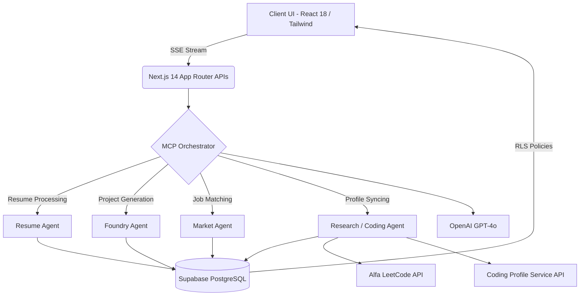

<div align="center">
  
  <h1>PrioryxAI</h1>
  <p><strong>Your Academic & Career Command Center</strong></p>
  <p><em>An AI-powered command center for engineering students. Syncs your academic deadlines, GitHub, LeetCode, and HackerRank to tell you exactly what to focus on next.</em></p>
  
  <p><strong>Milestone: Over 100+ Active Users & $21.12+ Revenue Generated</strong></p>
  
  <p>
    <a href="#about-the-project">About</a> •
    <a href="#problem-statement">Problem Statement</a> •
    <a href="#core-features">Features</a> •
    <a href="#system-architecture">Architecture</a> •
    <a href="#technology-stack">Tech Stack</a> •
    <a href="#getting-started">Getting Started</a> •
    <a href="#workflow">Workflow</a> •
    <a href="#pricing-structure">Pricing</a>
  </p>
</div>

---

## About the Project

Engineering students don't lack tools. They lack clarity.

Between exams, assignments, projects, and job applications, everything feels important — but nothing tells you what actually matters right now. That's the problem we set out to solve.

**PrioryxAI** is an AI-powered command center that brings your academic and career workflow into a single system and tells you exactly what to focus on next, based on real urgency and impact. 

Not another productivity tool — a decision-making engine.

## Problem Statement

Students and junior professionals often navigate a highly fragmented ecosystem:
- **Scattered Tools:** Academic deadlines, internship applications, and version control metrics are stored across disconnected platforms, providing no unified view of immediate priorities.
- **Generic Guidance:** Endless consumption of tutorials without building verifiable, project-based proof of acquired skills.
- **Blind Problem Solving:** Students grind LeetCode or HackerRank randomly without a targeted strategy, unaware if their practice aligns with their specific career stream (e.g., SDE vs ML) or addresses their actual weak spots.
- **Missed Opportunities:** Applying to positions without quantitative assurance that current skills align with market demands.

**PrioryxAI solves this** by centralizing the entire career pipeline into a single, cohesive command center, eliminating the need to juggle multiple applications.

---

## Core Features

Our platform provides comprehensive tools designed for academic and professional acceleration:

- **AI-Ranked Priority Feed (Next Move Card):** Every exam, assignment, and internship deadline is scored by urgency multiplied by career impact. 
- **Autonomous Agent Architecture:** Six specialized Model Context Protocol (MCP) agents handle complex workflows asynchronously.
- **Badge Intelligence:** Translates HackerRank badges into actionable technical proficiency scores.
- **Context-Aware AI Assistant:** Provides study schedules and task prioritization based on active deadlines and career goals.
- **Coding Profile Intelligence:** Deeply analyzes your LeetCode and HackerRank solving history via live APIs. GPT-4o generates personalized feedback, pinpoints technical weak areas, and recommends high-leverage problems tailored exactly to your target career stream. It also identifies which specific languages or tech stacks you should focus on right now to maximize your leverage, and suggests curated YouTube videos on current trends to accelerate your learning.
- **AI-Powered Learning Feed:** A dedicated YouTube Recommendation Engine that curates and ranks highly relevant technical videos. It dynamically pulls signals from your LeetCode weak spots, resume skill gaps, HackerRank missing badges, and target company tech stacks, delivering precise video tutorials (with AI-generated reasoning) to accelerate your growth.
- **Foundry (Project Generation):** Automatically engineers multi-phase software projects to systematically fill identified skill gaps.
- **GitHub Sync & Insights:** Tracks contribution streaks, repository health, and primary languages, surfacing the optimal repositories to showcase to recruiters.
- **Interactive Terminal:** A simulated command-line environment for verifying code submissions through project phase-gates.
- **Job Market Kanban:** A drag-and-drop board for tracking internship and job applications.
- **Matched Internship Openings:** Correlates GitHub languages and coursework with live Internshala listings, highlighting stipends and matching skills.
- **Peer Collaboration:** AI-driven matchmaking that pairs users with complementary technical profiles.
- **Recruiter-Ready Profile:** A public portfolio page that synthesizes GitHub repositories and completed tasks into professional bullet points.
- **Resume Intelligence:** Real-time semantic parsing and SWOT (Strengths, Weaknesses, Opportunities, Threats) analysis for uploaded PDF resumes.
- **Timetable Scanner:** Utilizes GPT-4o Vision to extract dates from photographed schedules, automatically populating the priority feed.
- **Verification Gates:** Enforces learning validation through AI code reviews before allowing progression to subsequent project phases.

---

## System Architecture

The platform heavily utilizes **Model Context Protocol (MCP)** principles, delegating complex multi-step reasoning to autonomous agents running on Next.js Edge and Node runtimes.



---

## Technology Stack

PrioryxAI was developed to address the specific challenges of managing scattered deadlines and fragmented technical profiles. 

- **Framework:** [Next.js 14](https://nextjs.org/) (App Router, Server Actions)
- **Language:** TypeScript (Strict Mode)
- **Frontend UI:** [React 18](https://react.dev/), [Tailwind CSS](https://tailwindcss.com/), [Framer Motion](https://www.framer.com/motion/)
- **Backend & Authentication:** [Supabase](https://supabase.com/) (PostgreSQL, Row Level Security, Edge Functions)
- **AI Engine:** OpenAI GPT-4o & GPT-4o Vision (JSON Mode, Structured Outputs)
- **Caching & Rate Limiting:** [Upstash](https://upstash.com/) (Redis)
- **Payments:** Razorpay
- **Hosting:** Vercel
- **Authentication Providers:** GitHub OAuth, Google OAuth

---

## Getting Started

### Prerequisites
- Node.js 18.x or later
- A [Supabase](https://supabase.com/) Project
- An [OpenAI API](https://platform.openai.com/) Key
- (Optional) Upstash Redis for advanced rate limiting

### Installation

1. **Clone the repository**
   ```bash
   git clone https://github.com/codewithyug06/PrioryxAI.git
   cd PrioryxAI
   ```

2. **Install dependencies**
   ```bash
   npm install
   ```

3. **Configure Environment Variables**
   Duplicate `.env.example` into `.env.local` and populate the required keys:
   ```bash
   cp .env.example .env.local
   ```
   *Required Keys:*
   - `NEXT_PUBLIC_SUPABASE_URL`
   - `NEXT_PUBLIC_SUPABASE_ANON_KEY`
   - `OPENAI_API_KEY`

4. **Initialize the Database**
   Execute all SQL migrations located in the root directory within your Supabase SQL Editor to establish the necessary schema (Profiles, Projects, Resumes, etc.).

5. **Run the Development Server**
   ```bash
   npm run dev
   ```
   Navigate to [http://localhost:3000](http://localhost:3000) in your browser.

---

## Workflow

The primary user journey is designed for immediate impact:

1. **Authentication**
   Sign in via GitHub or Google. PrioryxAI automatically imports repository data, programming languages, and contribution streaks without manual configuration.
2. **Data Ingestion**
   Input upcoming deadlines textually or upload a photograph of an academic timetable. The AI extracts and evaluates every date instantly.
3. **Prioritization**
   The dashboard surfaces the single highest-leverage task based on calculated urgency, career impact, and current workload.

---

## Project Structure

```text
PrioryxAI/
├── src/
│   ├── app/                         # Next.js App Router
│   │   ├── api/                     # Backend API Routes
│   │   │   ├── career/              # Resume parsing and SWOT routes
│   │   │   ├── foundry/             # Project generation and verification
│   │   │   ├── hackerrank/          # HR syncing, analysis, and validation
│   │   │   ├── leetcode/            # LC syncing, daily challenges
│   │   │   ├── platforms/unified/   # Aggregated coding profile data
│   │   │   └── webhooks/            # GitHub & Razorpay webhooks
│   │   ├── career/                  # Career Module Pages
│   │   │   ├── coding/              # LeetCode & HackerRank Dashboards
│   │   │   ├── foundry/             # Project IDE & Terminal views
│   │   │   ├── market/              # Job Board & Kanban
│   │   │   └── resume/              # Upload & SWOT UI
│   │   └── (core views)/            # /feed, /assistant, /profile
│   ├── components/                  # Reusable UI Architecture
│   │   ├── leetcode/                # Charts, Radars, and Stat Cards
│   │   └── ui/                      # Base tailwind UI elements
│   └── lib/                         # Core Logic & Utilities
│       ├── hackerrank/              # Types, CPS client, AI analyzer
│       ├── leetcode/                # Types, Alfa client, AI analyzer
│       ├── mcp/                     # Agent definitions (resume, foundry, etc.)
│       ├── supabase/                # Middleware and client providers
│       └── openai.ts                # OpenAI client initialization
├── supabase-migration-*.sql         # Sequential PostgreSQL Schema Migrations
├── tailwind.config.ts               # Theme definitions
└── package.json
```

---

## Evaluation Methodology

PrioryxAI utilizes quantitative algorithms to assess user readiness:

1. **Coding Score (0-100):**
   - **LeetCode:** Weighted by difficulty distribution (Easy/Medium/Hard), overall acceptance rate, and contest rating.
   - **HackerRank:** Weighted by relevant Stream Badges (40%), Certifications (25%), and Total Problems Solved (35%).
   - **Unified Algorithm:** `(LC * 0.55) + (HR * 0.30) + (Bonus Platforms * 0.15)`
2. **Resume SWOT Analysis:**
   - Conducts semantic evaluations against target role descriptions, contrasting direct keyword matches with critical omissions.
3. **Phase-Gate Verification:**
   - During Project Foundry modules, the AI reviews code submissions simulating a Senior Engineer's evaluation. Progression is binary: if the submission fulfills requirements without major anti-patterns, the user advances; otherwise, progression is blocked pending revisions.

---

## Pricing Structure

PrioryxAI offers a transparent pricing model. Start for free and upgrade as your requirements scale.

### **Free Tier ($0 / month)**
*Designed for initial onboarding and basic task management.*
- 25 AI-ranked tasks
- 5 AI assistant messages per day
- 3 timetable scans per day
- Initial GitHub synchronization
- Public profile page and foundational statistics

### **Pro Tier (₹59 / month)**
*Engineered for comprehensive academic and professional execution.*
- Unlimited priority feed tasks
- Unlimited AI assistant messages
- 10 timetable scans per day
- Automated GitHub synchronization every 6 hours
- Matched Internshala job openings
- AI-generated PDF resumes
- Auto-scheduled focus blocks
- Advanced GitHub health and streak analytics

---
<div align="center">
  <p>PrioryxAI — Academic & career command center.</p>
  <p><strong><a href="https://prioryxai.in/feed">Get Started</a></strong></p>
  <p>Support: prioryxai@gmail.com</p>
</div>
